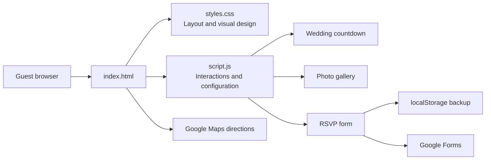

# iMarriage

<div align="center">

**A refined digital wedding invitation for Angélica & Paulo, designed for a graceful and memorable guest experience.**

[](https://developer.mozilla.org/docs/Web/HTML)
[](https://developer.mozilla.org/docs/Web/CSS)
[](https://developer.mozilla.org/docs/Web/JavaScript)
[](https://www.google.com/forms/about/)

</div>

## Overview

iMarriage is a premium digital wedding invitation built for the celebration of **Angélica & Paulo**. It replaces a static invitation with an elegant, accessible page where guests can discover the event details, get directions, browse the couple's story and photo gallery, and confirm attendance.

The design draws inspiration from pearl-white silk and satin: soft folds and highlights are created entirely with CSS, complemented by champagne-gold details, classic typography, and black-and-white photography.

## Features

### Guest experience

- Responsive, mobile-friendly wedding invitation
- Countdown to the ceremony
- Ceremony and reception details in one place
- Direct Google Maps links for both venues
- Couple story and curated photo gallery
- Wedding gift guidance tailored to the Japanese celebration tradition
- FAQ with practical information for guests

### RSVP

- Simple confirmation form for name, guest count, phone number, and message
- Background submission to a configurable Google Form
- Local browser backup of submitted confirmations using `localStorage`
- Immediate confirmation feedback after submission

### Design and usability

- Pearl and satin effect created with native CSS, without external background images
- Smooth anchor navigation and a responsive mobile menu
- Scroll-reveal animations for page sections
- Accessible labels, status feedback, and descriptive image alternatives

## Tech Stack

| Area | Technology | Purpose |
| --- | --- | --- |
| Structure | HTML5 | Semantic invitation content and form markup |
| Styling | CSS3 | Responsive layout, silk texture, typography, and animations |
| Interactions | Vanilla JavaScript | Countdown, mobile navigation, gallery population, and RSVP handling |
| RSVP delivery | Google Forms | Receives guest confirmations without a custom backend |
| Persistence | Browser `localStorage` | Keeps a local copy of RSVP submissions on the guest's device |
| Maps | Google Maps | Provides directions to the ceremony and reception venues |
| Hosting | GitHub Pages | Static-site publishing option |

## Architecture

The project keeps its front end deliberately lightweight. `index.html` defines the invitation sections, `styles.css` contains the visual system and responsive behavior, and `script.js` centralizes event configuration and client-side interactions.



### Main files

- **`index.html`:** invitation content, event information, venue links, RSVP form, gifts, and FAQ
- **`styles.css`:** color tokens, pearl-satin background, responsive grid, buttons, and animations
- **`script.js`:** wedding configuration, countdown, navigation, gallery rendering, and RSVP submission
- **`assets/`:** the couple's hero, story, and gallery photographs

## Wedding Information

| Detail | Information |
| --- | --- |
| Couple | Angélica & Paulo |
| Date | December 25, 2027 |
| Time | 7:00 PM |
| Ceremony | Igreja Católica de Ota, Santa Clara |
| Reception | Honjo City Community Hall |
| Dress code | Smart casual / formal attire |
| Hero verse | “Therefore a man shall leave his father and his mother and hold fast to his wife, and they shall become one flesh.” — Genesis 2:24 |

## Project Structure

```text
iMarriage/
├── assets/              # Wedding photographs
├── index.html           # Invitation page
├── script.js            # Configuration and client-side behavior
├── styles.css           # Visual design and responsive styles
└── README.md
```

## Running Locally

### Prerequisites

- A modern web browser
- Optionally, the VS Code **Live Server** extension for local development

### Installation

1. Clone the repository:

   ```bash
   git clone https://github.com/paulohashisaka/iMarriage.git
   cd iMarriage
   ```

2. Open `index.html` directly in a browser, or start it with Live Server in VS Code.

3. With Live Server, right-click `index.html` and choose **Open with Live Server**.

## Configuration

Wedding-specific settings are grouped in `weddingConfig` inside `script.js`.

| To update | Where |
| --- | --- |
| Countdown date and time | `weddingConfig.weddingDate` in `script.js` |
| Hero, story, and gallery photos | `weddingConfig.images` in `script.js` |
| RSVP local storage key | `weddingConfig.storageKey` in `script.js` |
| Google Form endpoint and field IDs | `weddingConfig.googleForm` in `script.js` |
| Visible event details and Maps links | `index.html` |
| Colors, satin texture, and typography | CSS variables in `styles.css` |

### Google Forms RSVP setup

Update the `googleForm` configuration in `script.js` with your Google Form submission URL and field IDs:

```js
googleForm: {
  action: "https://docs.google.com/forms/d/e/YOUR_FORM_ID/formResponse",
  fields: {
    name: "entry.000000000",
    guests: "entry.000000000",
    phone: "entry.000000000",
    message: "entry.000000000",
  },
},
```

Use the Form's `formResponse` endpoint rather than its public `viewform` URL. If the form is recreated, update the `entry.*` field IDs as well.

### Updating the gallery

Keep the number of images in `weddingConfig.images.gallery` synchronized with the `` elements in `index.html`. If the gallery size changes, review the `.gallery-grid` and `.gallery-item:nth-child(...)` rules in `styles.css` so the mosaic layout still fits the new number of photos.

## Deployment

This is a static site and can be published through GitHub Pages:

1. Push `index.html`, `styles.css`, `script.js`, `README.md`, and `assets/` to a GitHub repository.
2. Open **Settings → Pages** in the repository.
3. Select the main branch as the publishing source.
4. Save and wait for GitHub Pages to provide the public URL.

## Technical Decisions and What I Learned

### Creating a premium visual identity with CSS

The satin background uses layered gradients, subtle repeating textures, opacity tokens, and blur instead of a large background image. This preserves the intended textile feel while keeping the page lightweight and easy to customize.

### Keeping a static RSVP flow practical

Google Forms makes it possible to collect confirmations without maintaining a server or database. The page also stores a local copy of each submission, which provides a small resilience layer for the guest's session.

### Centralizing changeable content

Photos, the wedding date, RSVP endpoint, and form field identifiers are grouped in `weddingConfig`. This makes the invitation easier to adapt without searching through the interaction code.

### Designing an invitation for every screen size

The layout, navigation, gallery, and action buttons adapt from desktop to compact mobile screens, where most guests are likely to open the invitation.

## Author

**Paulo Hashisaka**

- [GitHub](https://github.com/paulohashisaka)
- Based in Japan
- Web development learner focused on practical, multilingual products
